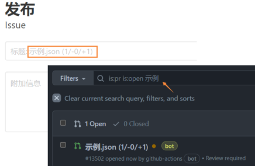
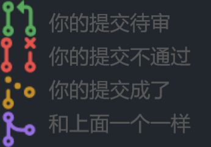

# 查询我的请求状态

!!! warning "审核员正在举行罢工抗议"

    提交一次就可以了，请不要反复提交来折磨我们的审核成员。

    <del>哦我的上帝，如果您真的这么做了，我发誓会用靴子狠狠抽你的屁股，我发誓我会的。<del>

## 我的提交在哪里

* 位于 dd-center/vdb 仓库下的 Pull requests (pr) 页面下，就是<a href="https://github.com/dd-center/vdb/pulls" target="_blank">这里</a>。

* 请在这个页面的搜索框里输入你提交时的**标题**，一般默认是 VTB 的 **名字**。

---

## 我的提交怎么样了

---

## 关于审核

* 所有的提交要经过人工审核后才会合并到数据库，请参考我们的[收录标准](../wiki/criterion.md)。

* 收录标准省流：对于 VTB，经常用虚拟形象，很少有真人形象，就可以收录了；对于社团，要求商业性质且仍在活跃运营。

* 审核成员（是志愿者，不保证全天在线）会尽快处理您的提交，一般 1~3 天之内。

!!! tip "关于标签"
    如果您的提交被打上了 `observe` 标签，说明审核成员对您的提交存疑。
    
    您可以在留言来补充更多信息，或等待审核成员进行 3~14 天的观察。

---

## 为什么我的提交不通过？

这是一些常见的原因：

* 不符合我们的[收录标准](../wiki/criterion.md)，或在观察之后仍未能确定的。

* 您没有提供用户的账号信息。

* 所属社团未被收录（通常由审核代为修改）。

* 语言信息格式不规范（通常由审核代为修改）。

* 您重复提交了（通常审核只会保留一个提交，其他的会被打回）。

* <del>您的提交实在是太不规范，连审核都懒得改了。<del>

---

## 提交通过后会发生什么

* 这名 VTB 的相关公开信息会被记录在数据库内，这些信息会公开给其他人免费使用。
