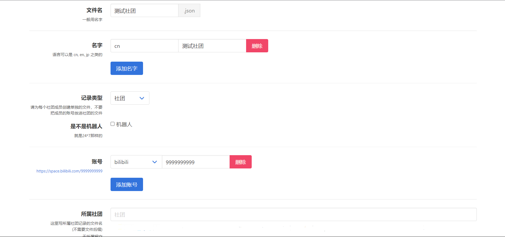
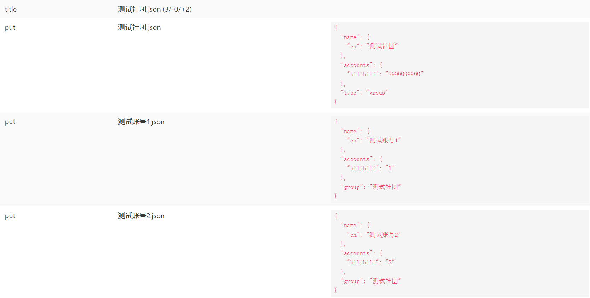
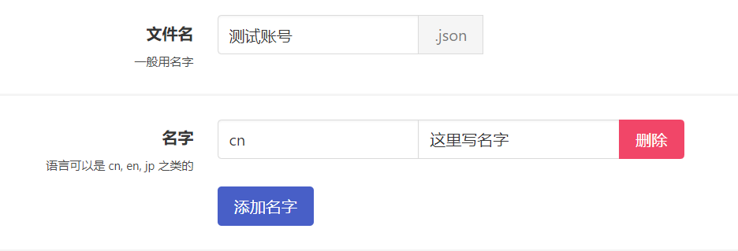
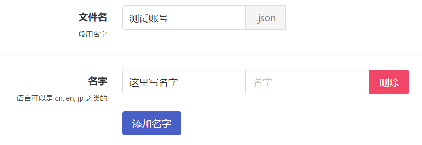
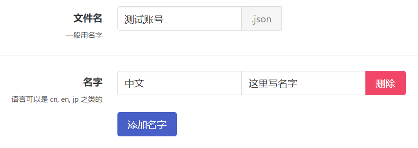
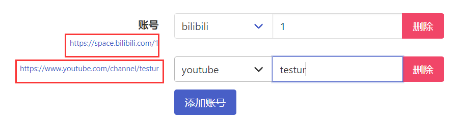

# 创建并提交社团

!!! tip "注意"
    * VDB 目前**不收录互助/非商业性质/未在运营的社团**。这种社团旗下的 VTB 视为个人势收录。

    * 此外，新建一个社团需要旗下**至少有两名达标的 VTB，请一次性提交至少三份文件**。

## 创建

* 点击左下角`新建`按钮。

* 请将社团的`ID`填入到`文件名`。

!!! warning "添加名字：易错步骤"
    * 点一下`添加名字`按钮，从`cn`、 `en`、 `jp`（中文名请填写`cn`，英文名请选择`en`，日文名请选择`jp`）等当中挑选合适的填入`语言`输入栏（位于蓝色`添加名字`按钮的正上方）。
    * 将`ID`或`社团的其他名字`填入`名字`（位于`语言`输入栏右侧）。

!!! tip "添加名字：正确的例子"
    

!!! warning "添加名字：常见错误"
    

!!! warning "添加名字：常见错误"
    

* 如有多个名字，请点击`添加名字`按钮并重复上一步骤。

* `记录类型`改为`社团`。

* 不要勾选`机器人`。

* 如果社团有官方账号，请点一下`添加账号`按钮，选择平台并完善后面的内容，然后点一下左侧的预览确认无误（**注意这里哔哩哔哩平台应填写 UID 而非 ID，纯数字**）。

* 如果社团有其他平台的账号，请点击`添加账号`按钮并重复上一步骤（**海外社团建议完善外网账号，YouTube 账号一般请用新版`youtubeAt`而非旧版`youtube`**）。

!!! tip "验证账号是否正确添加"
    
    点击并打开每个账号左侧蓝色的`网页链接`（图中被红框框住的区域）。

    若链接可以**正确打开**并**指向您提交的社团**，便意味着该账号已经被正确添加了。

    反之则代表您的账号信息填写有误，请仔细检查，错误的账号信息不会通过审核。

* 请将`所属社团`留空。

---

## 保存

* 拉到最下面，点一下`保存`。

---

## 添加所属 VTB

* 查阅 [查重](duplicate.md) → [创建并提交 VTB](create.md) 部分（`创建`并`保存`，但是不要`提交`），添加一名 VTB，将`所属社团`改为此社团的名字。

* 重复上述操作，再添加一位 VTB（`创建`并`保存`，但是不要`提交`）。

* 如果社团还有 VTB，你可以继续添加，不过添加一个新的社团至少需要 2 名 VTB。

!!! tip "编辑现有的 VTB"
    * 若是之前已经有此社团的 VTB 被作为个人势添加，可以直接修改他们的账号记录。

    * 你也可以在`Panel`内选择`编辑`，修改已收录的 VTB 的`所属社团`。

---

## 提交

* 拉上去，点一下`提交!(3)`（或者是`提交!(4)` `提交!(5)`之类的，总之这个数字一定要大于等于 3）。

!!! tip "重要"
    仔细看`测试`部分，如果出现`Error: 0`，则没有问题，否则你的申请**大概率不会通过**，请根据提示进行更改。

* 点击下方提交按钮，出现网页链接后即代表提交成功，**我们会有人工成员进行审核，可能需要几天时间**。

* 如果需要再次提交 VTB 或社团，请务必**刷新网页**后重复上述操作，一次提交一个，不要直接前往新建菜单。
