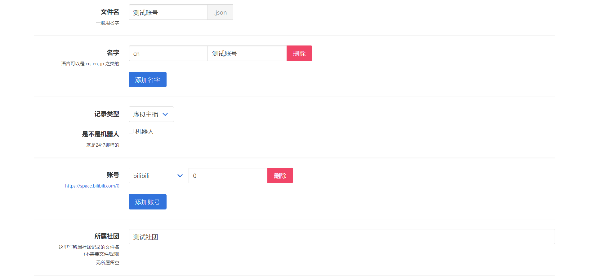

# 创建并提交 VTB

## 创建

* 点击左下角`新建`按钮。

* 请将 VTB 的`ID`填入到`文件名`。

!!! warning "添加名字：易错步骤"
    * 点一下`添加名字`按钮，从`cn`、 `en`、 `jp`（中文名请填写`cn`，英文名请选择`en`，日文名请选择`jp`）等当中挑选合适的填入`语言`输入栏（位于蓝色`添加名字`按钮的正上方）。
    * 将`ID`或`VTB 的其他名字`填入`名字`（位于`语言`输入栏右侧）。
    * 请务必标准填写语言与名字，`ID`与`名字`必须为 VTB 规范名字，不允许出现诸如`name-xx冠`、`name-xx冠名`、`name-x月x日满月`、`name-x号xx回`、`name-xx版`等内容。

!!! tip "添加名字：正确的例子"
    

!!! warning "添加名字：常见错误"
    

!!! warning "添加名字：常见错误"
    

* 如有多个名字，请点击`添加名字`按钮并重复上一步骤。

* 不需要更改`记录类型`。

* 如果是**AI 直播或由程序控制的形象等非真人直播**，请勾选`机器人`，一般情况也不需要更改。

* 单击`添加账号`按钮，选择平台并完善平台信息，然后单击一下左侧的预览确认无误（**注意这里哔哩哔哩平台应填写 UID 而非 ID，纯数字**）。

* 如果 VTB 有其他平台的账号，请点击`添加账号`按钮并重复上一步骤（**海外 VTB 建议完善外网账号，YouTube 账号一般请用新版`youtubeAt`而非旧版`youtube`**）。

!!! tip "一定要验证账号是否正确添加"
    
    点击并打开每个账号左侧蓝色的`网页链接`（图中被红框框住的区域）。

    若链接可以**正确打开**并**指向您提交的 VTB**，便意味着该账号已经被正确添加了。

    反之则代表您的账号信息填写有误，请仔细检查，错误的账号信息不会通过审核。

* 个人势 VTB 请将`所属社团`留空，有社团的 VTB 请先在`所属社团`内尝试搜索社团名，并在下方的搜索结果内选择正确的名字。

!!! danger "所属社团搜不到怎么办"
    搜索不到相关社团意味着**该社团未收录**，请**务必先执行[添加社团操作](../wiki/create-group.md)**。

    **请勿直接输入社团名字！**<del>空着都比输一个未收录的社团好！<del>
    
    直接输入一个未收录的社团会给审核员带来很大的困扰！<del>哪天心情不好直接给你 close 了！<del>
    
    <del>虽然大多数情况还是会辛苦审核员自行修改。<del>

    添加的社团将会以[社团收录标准](../criterion/add-group.md)进行审核，社团不达标的作为个人势收录。

---

## 保存

* 拉到最下面，点一下`保存`。

---

## 提交

* 拉上去，点一下`提交!(1)`。

!!! tip "重要"
    仔细看`测试`部分，如果出现`Error: 0`，则没有问题，否则你的申请**大概率不会通过**，请根据提示进行更改。

* 点击下方提交按钮，出现网页链接后即代表提交成功，**我们会有人工成员进行审核，可能需要几天时间**。

* 如果需要再次提交 VTB 或社团，请务必**刷新网页**后重复上述操作，一次提交一个，不要直接前往新建菜单。
